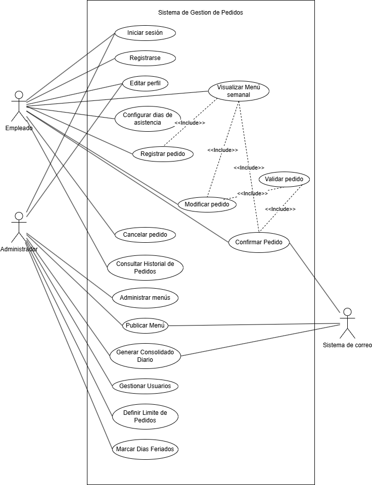

# Entrega 1 — Análisis del Sistema

**Grupo**: [Nombre del grupo]  
**Proyecto**: [Nombre del proyecto elegido]  
**Fecha de entrega**: 30/04/2026

---

## 1. Identificación de Actores

| Actor | Rol / Función en el sistema | Tipo (usuario final, sistema externo, etc.) |
|-------|-----------------------------|---------------------------------------------|
|       |                             |                                             |

## 2. Requisitos Funcionales

| ID    | Descripción | Actor | HU relacionada |
|-------|-------------|-------|----------------|
| RF-01 |             |       |                |
| RF-02 |             |       |                |

> Cada requisito debe describir una acción concreta: "El sistema debe permitir que [actor] [acción]..."

## 3. Requisitos No Funcionales

| ID     | Categoría (rendimiento, seguridad, usabilidad, etc.) | Descripción                                                                                                              |
|--------|-----------------------------------------------------|--------------------------------------------------------------------------------------------------------------------------|
| RNF-01 | Usabilidad                                          | El sistema debe tener una interfaz clara, intuitiva y facil de usar tanto como para empleados como para administradores. |
| RNF-02 | Usabilidad                                          | La interfaz  debe adaptarse a diferentes tamaños de pantalla, pc de escritorio, celulares, tablets, etc.                 |
| RNF-03 | Rendimiento                                         | El tiempo de respuesta de las principales funciones no debe superar los 3 segundos en condiciones normales.              |
| RNF-04 | Seguridad                                           | El sistema debe tener autenticacion y autorizacion segun rol del usuario (administrador / empleado).                     |
| RNF-05 | Seguridad                                           | Credenciales cifradas  HTTPS.                                                                                            |
| RNF-06 | Compatibilidad                                      | La pagina debe funcionar correctamente en los navegadores modernos mas utilizados.                                       |
| RNF-07 | Integracion Externa                                 | El sistema debe  integrarse correctamente con un servicio de correos externo.                                            |
| RNF-08 | fiabilidad integracion externa                      | Los envios de correo deben ser confiables, en caso de fallo temporal el sistema debe reintentar el envio.                |

## 4. Historias de Usuario

| ID    | Como...       | Quiero...                  | Para...                            |
|-------|---------------|----------------------------|------------------------------------|
| HU-01 | [rol/actor]   | [acción o funcionalidad]   | [beneficio o resultado esperado]   |
| HU-02 |               |                            |                                    |

## 5. Diagrama de Casos de Uso

> Insertar imagen del diagrama exportado desde Draw.io, Lucidchart, StarUML o similar.  
> Guardar la imagen en esta misma carpeta (`docs/`) y referenciarla abajo.

## 6. Especificación de Casos de Uso

### CU-01 — [Nombre del caso de uso]

| Campo | Detalle |
|---|---|
| **Actor principal** | |
| **Descripción** | |
| **Precondiciones** | |
| **Postcondiciones (criterios de aceptación)** | |

| Secuencia Normal (Camino feliz) | Excepciones / Alternativas |
|---|---|
| 1.  |  |
| 2.  |  |
| 3.  |  |

---

> Repetir la ficha completa para cada caso de uso del diagrama.
> Las excepciones se numeran ligadas al paso del que se desvían (ej: 4.1 en la misma fila que el paso 4).
